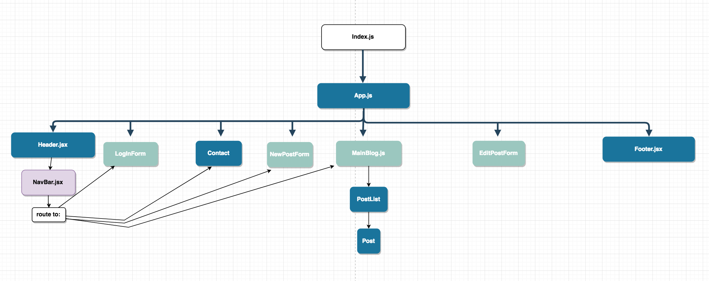

# Capstone Planning

#### by Krystal Foster
#### Dec 7, 2018

## Name of Project: Blog Engine

### Project’s Purpose or Goal:

A React CRUD app that allows a selection of authenticated contributors to update and curate content on a given topic. Will probably evolve into a personal design portfolio to house some of my personal art after MVP is hit but I am focused on making a functioning mock-blog for now that I can specialize in the coming weeks. The project currently runs off a firebase database but I wish to add redux, user authentication, a rich text editing tool, the ability for authorized users to edit/delete/upload their own posts, as well as comment on others. My end goal is to solidify my understanding of state maintenance and data flow in React. I think that building my own blog is a perfect opportunity for that.

### List the absolute minimum features the project requires to meet this purpose or goal:

* routing throughout, including log in page, blog entry form, home, etc.
* Working firebase database that stores and pushes submitted entries to DOM ✔️
* the ability for authorized users to add (✔️), edit and delete entries.
* User authentication with the correct authorized views and control over their own posts.
* user dashboard with convenient links to their past posts for review and editing purposes.
* Master blog list limited to so many characters, with the full post visible on click.
* Rich text editor feature that preserves whitespace and text formatting for bloggers.
* subtle page transitions and animations to the point of being almost subliminal but adding some sugar to the whole user flow thing

## NOTE: Clicking the "home" link routes you to the blog portion of this project which is currently informed by a firebase database, but the api key is needed to access it. Ultimately I will deploy it to firebase publicly, in the meantime, feel free to ask me for my config file and credentials or to make your own. (The firebaseConfig.js file should live inside the constants folder, which can be found in src)

### What tools, frameworks, libraries, APIs, modules and/or other resources (whatever is specific to your track, and your language) will you use to create this MVP? List them all here. Be specific.

* React
* JavaScript
* Firebase database and auth
* possibly draft.js or another framework to allow rich text editing

### If you finish developing the minimum viable product (MVP) with time to spare, what will you work on next? Describe these features here: Be specific.

* Admin component with the ability to monitor and edit all community posts
* commenting section for each post
* bookmark and favoriting features, for users to upvote and save articles for future reference (they would have access to this list on their user dash)
* Search component
* multi-page routing after every 10 posts and better site organization
* Blog calendar and archive component  
* further down the road or by demo day I would like to teach myself socketing or how to incorporate chat rooms but it's definitely not necessary at this point.

## Current Component Structure

### Setup Instructions

First, make sure you have node package manager installed globally. Check out https://www.npmjs.com/get-npm for information on that.

#### Then:

`$ git clone https://github.com/Eucile/capstone-plan-2`

`$ cd capstone-plan-2`

`$ npm install`

`$ npm run start`

### License

Copyright (c) 2018 **_{ Krystal Foster}_**
